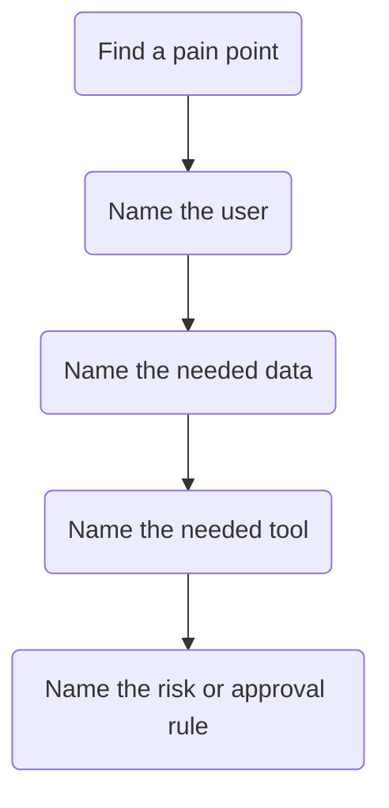

## Outcome

Participants leave with a realistic idea of what they could automate or expose through a future MCP server.

:::: {.lesson-grid}
::: {.lesson-panel}
### Internal lookup

Which repeated search task could become a tool.
:::

::: {.lesson-panel}
### Public data blend

Which outside API or data feed could enrich answers.
:::

::: {.lesson-panel}
### Governance question

Which tasks require approval, logging, or human review.
:::
::::

::: {.callout-tip}
## Workshop prompt

If you had one safe tool to expose next month, what would it do and who would trust it enough to use it?
:::
