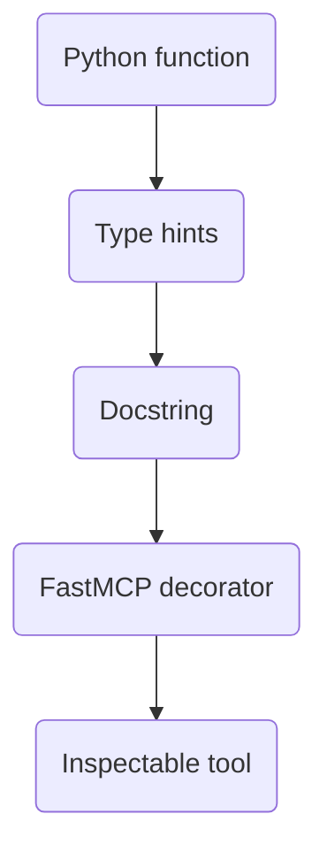

## Outcome

Advanced users see how plain Python functions become discoverable MCP tools.



::: {.callout-important}
## Core lesson

The important transformation is not complexity. It is structure.
:::

## Minimal example

```python
from mcp.server.fastmcp import FastMCP

mcp = FastMCP("demo")

@mcp.tool()
def ping(name: str) -> str:
    """Return a simple greeting."""
    return f"Hello, {name}!"
```

## Canonical walkthrough shape

- one lookup-style tool
- one data or status tool
- short descriptions with good parameter names
- a run path that works locally before deployment

::: {.callout-note}
## Teaching prompt

Ask the room which parts are business logic and which parts are protocol glue.
:::
