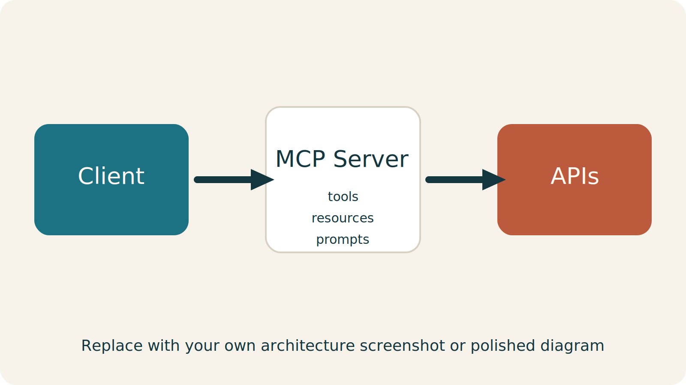
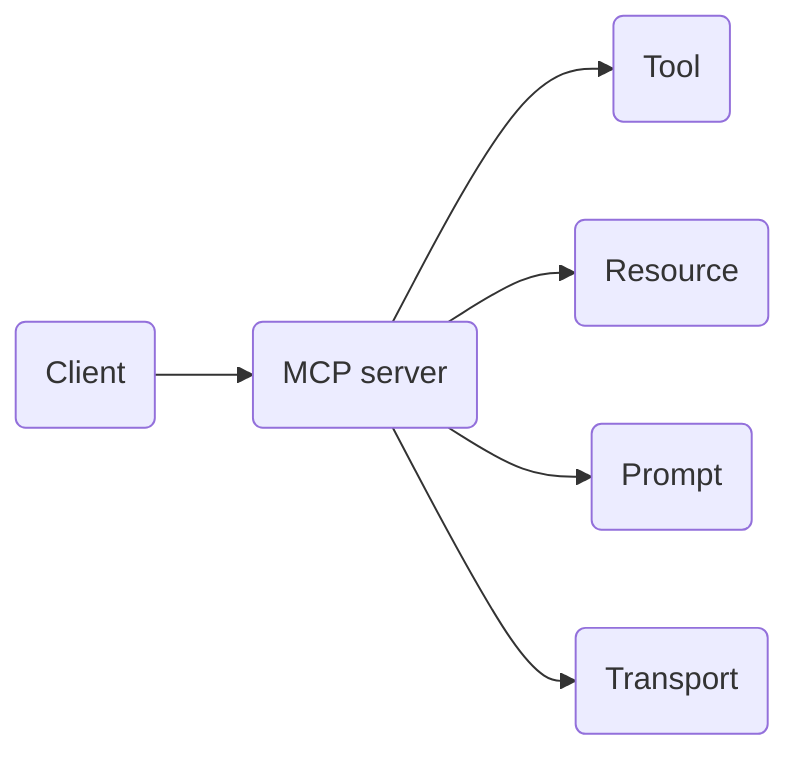

## Outcome

Participants understand the small number of protocol concepts that matter for building a first server.

::: {.placeholder-figure}

:::

:::: {.lesson-grid}
::: {.lesson-panel}
### Tool

A function the client can call.
:::

::: {.lesson-panel}
### Resource

Data the client can retrieve.
:::

::: {.lesson-panel}
### Prompt

Reusable guidance that shapes a task.
:::
::::

::: {.callout-tip}
## Teaching boundary

Concentrate on tools first. They produce the fastest visible value during a live class.
:::
