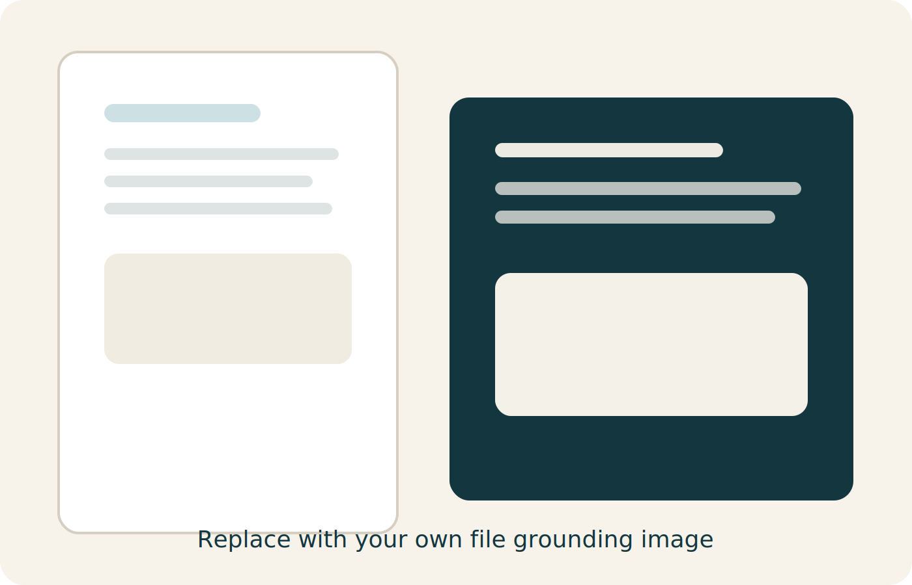

## Outcome

Attendees see that a well-chosen file instantly makes the agent more useful and more trustworthy.

:::: {.visual-grid}
::: {.choice-card}
### Option A

Word document about Swedish electricity zones and municipalities.
:::

::: {.choice-card}
### Option B

Spreadsheet with installed solar capacity.
:::

::: {.choice-card}
### Option C

Spreadsheet with electricity prices over time.
:::
::::

::: {.placeholder-figure}

:::

::: {.callout-important}
## What we are teaching

The file is not just content. It is the shape of the answers the agent can produce.
:::

```{mermaid}
flowchart LR
    A(Clean file) --> B(Better grounding)
    B --> C(Better retrieval)
    C --> D(Better answers)
```

## Simple evaluation questions

- Can the agent find the right fact quickly
- Can the agent summarize a table without guessing
- Can the agent say when the file does not contain the answer

::: {.callout-tip}
## Instructor shortcut

If a file is messy, tell attendees that this is a data-quality lesson rather than a prompt-quality lesson.
:::
