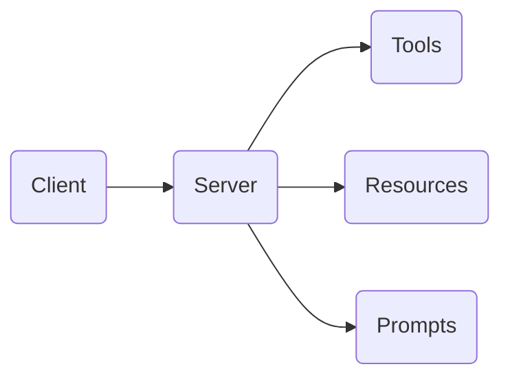

## Outcome

Attendees leave the morning knowing what MCP is for, without needing implementation details yet.

::: {.placeholder-figure}

:::

:::: {.lesson-grid}
::: {.lesson-panel}
### Client

The environment where the user interacts.
:::

::: {.lesson-panel}
### Server

The external capability provider.
:::

::: {.lesson-panel}
### Tool

A callable function with structured inputs.
:::
::::

::: {.callout-tip}
## Morning message

MCP is useful because it gives agents a standard way to access tools and data. The afternoon shows how to build one.
:::
