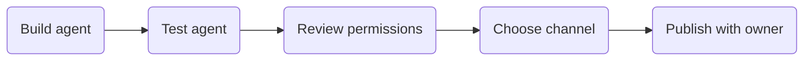

## Outcome

Attendees understand the difference between building an agent for themselves and publishing an agent for others.

:::: {.timeline-grid}
::: {.timeline-panel}
### Teams

A natural surface for collaboration and quick discovery.
:::

::: {.timeline-panel}
### Microsoft 365

Useful when the audience already works inside the broader suite.
:::

::: {.timeline-panel}
### Internal review

Important before any wider rollout.
:::
::::

::: {.callout-important}
## Facilitation tip

Frame publishing as governance, ownership, and discoverability, not just as a button at the end.
:::

## Before lunch, attendees should know

- who the agent is for
- which channel makes sense
- who would own future updates
