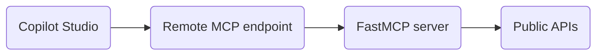
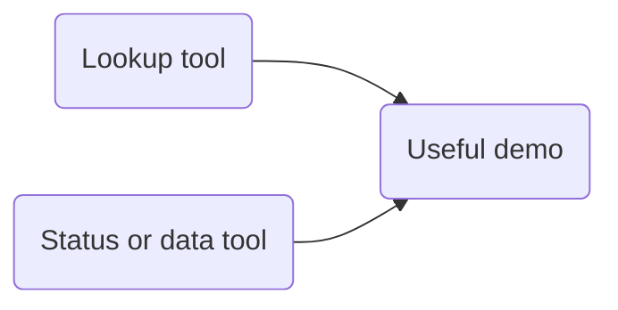
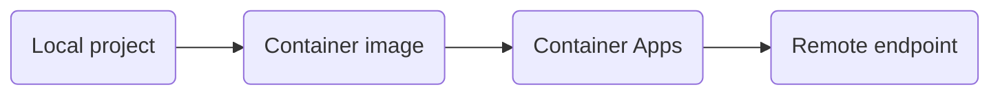
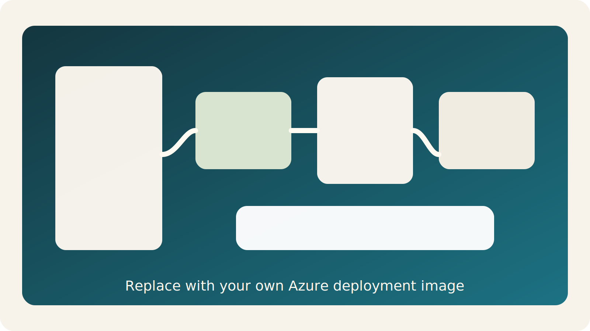

## The afternoon should make MCP feel buildable

::: {.visual-panel}

:::

::: {.notes}
Set the expectation: this is not protocol theory. This is a build story from Python function to usable endpoint.
:::

## One architecture picture beats a long definition



::: {.notes}
Walk left to right. Keep the words client and server, but do not dwell on formalism yet.
:::

## `uv` keeps the environment calm

:::: {.columns}
::: {.column width="58%"}
```powershell
uv lock
uv sync
uv run --directory .\mcp-servers\hello-world hello-world-server
```
:::

::: {.column width="42%"}
::: {.lesson-panel}
### Why it helps

- fewer setup surprises
- repeatable commands
- good live-demo rhythm
:::
:::
::::

::: {.notes}
Tell the room they do not need to memorize many commands. The repetition is part of the teaching design.
:::

## MCP concepts should stay concrete

:::: {.columns}
::: {.column width="33%"}
::: {.visual-panel}
### Tool

Call a function
:::
:::

::: {.column width="33%"}
::: {.visual-panel}
### Resource

Read useful data
:::
:::

::: {.column width="33%"}
::: {.visual-panel}
### Prompt

Reuse task framing
:::
:::
::::

::: {.notes}
Make it explicit that the class will mostly build tools. That keeps the scope manageable and visible.
:::

## A tiny server makes the pattern visible

```python
from mcp.server.fastmcp import FastMCP

mcp = FastMCP("hello-world")

@mcp.tool()
def ping(name: str) -> str:
    """Return a simple greeting."""
    return f"Hello, {name}!"
```

::: {.notes}
Pause here and ask the room which lines are ordinary Python and which line changes the role of the function.
:::

## The decorator is the turning point

```{.python code-line-numbers="|1-3|5|6-8"}
from mcp.server.fastmcp import FastMCP

mcp = FastMCP("hello-world")

@mcp.tool()
def ping(name: str) -> str:
    """Return a simple greeting."""
    return f"Hello, {name}!"
```

::: {.callout-important}
## Teaching line

`@mcp.tool()` is the moment a normal function becomes a discoverable capability.
:::

::: {.notes}
Spend time on this slide. It is the mental bridge most attendees need.
:::

## FastMCP removes protocol plumbing from the first lesson

:::: {.columns}
::: {.column width="50%"}
::: {.lesson-panel}
### It handles

- schema generation
- argument validation
- protocol wiring
:::
:::

::: {.column width="50%"}
::: {.lesson-panel}
### That lets us teach

- naming
- tool design
- response shape
:::
:::
::::

::: {.notes}
Emphasize that abstractions are helping us teach the right layer first, not hiding important concepts forever.
:::

## Two small tools are enough for a walkthrough



::: {.callout-note}
## Canonical shape

One simple lookup plus one live-data or status tool is enough to teach discovery, invocation, and deployment.
:::

::: {.notes}
Keep the class away from over-engineering. The goal is a pattern the room can reuse, not a large application.
:::

## Local inspection should happen before hosting

:::: {.columns}
::: {.column width="60%"}

:::

::: {.column width="40%"}
::: {.lesson-panel}
### Inspect for

- tool names
- descriptions
- parameters
- output shape
:::
:::
::::

::: {.notes}
Say clearly that a bad local loop becomes a worse cloud loop. Validate discoverability before deployment.
:::

## Deployment should feel like packaging, not magic



::: {.notes}
The deployment story should stay linear. If the room loses the story here, the Azure steps will feel random.
:::

## Azure needs one clean visual anchor



::: {.notes}
Replace this placeholder with your own Azure screenshot if you have one. Use it to keep the deployment explanation concrete.
:::

## Connection back to Copilot Studio closes the loop


::: {.callout-tip}
## Why this matters

This is the moment the protocol stops feeling abstract.
:::

::: {.notes}
Frame this as the payoff slide. The room has now seen a full path from code to capability.
:::

## The final discussion should stay practical

:::: {.columns}
::: {.column width="33%"}
::: {.visual-panel}
### Internal lookups

What should become a tool
:::
:::

::: {.column width="33%"}
::: {.visual-panel}
### Public data blends

What outside signal helps
:::
:::

::: {.column width="33%"}
::: {.visual-panel}
### Governance

What still needs approval
:::
:::
::::

::: {.notes}
End by translating the demo into attendee context. That is where future adoption ideas usually appear.
:::

## The takeaway is that MCP is approachable

::: {.callout-important}
## Final message

The goal is not protocol expertise. The goal is confidence that this can be built, tested, and connected.
:::

::: {.notes}
Close with confidence and restraint. The room should leave feeling that the path is understandable and repeatable.
:::
