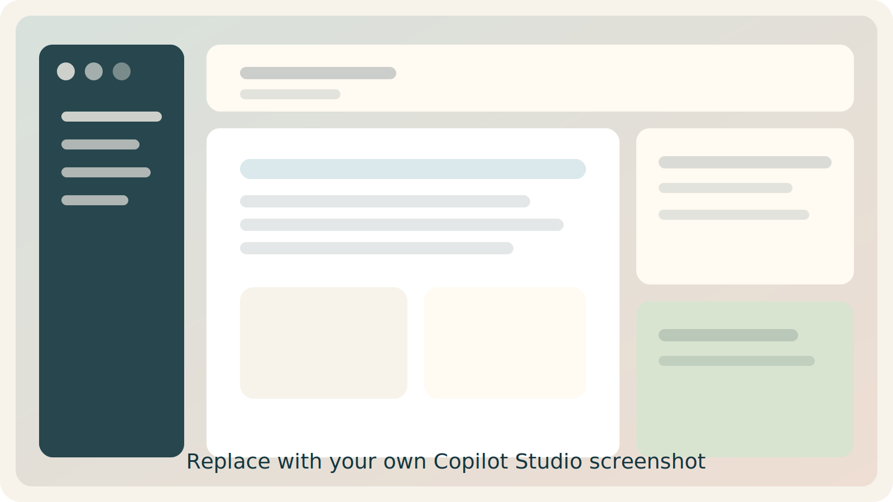

## A fast first win changes the room

::: {.visual-panel}

:::

::: {.notes}
Open with momentum. The point of the morning is not depth. It is confidence. Tell the room they only need one working flow before lunch.
:::

## Sign-in should feel easy

```{mermaid}
flowchart LR
	A(Access workspace) --> B(Open Copilot Studio)
	B --> C(Find create and test areas)
	C --> D(Start building)
```

::: {.callout-note}
## Presenter cue

Name only four surfaces: create, instruct, ground, test.
:::

::: {.notes}
Do not narrate every menu. Keep the interface tour anchored in user intent so beginners do not feel lost.
:::

## The interface should feel familiar fast

:::: {.columns}
::: {.column width="62%"}

:::

::: {.column width="38%"}
::: {.lesson-panel}
### Look for

- create
- instructions
- knowledge
- test chat
:::
:::
::::

::: {.notes}
If you have a real screenshot, replace the placeholder and point visually rather than verbally.
:::

## A first agent needs only role and boundaries

::: {.callout-important}
## Minimal recipe

Role. Goals. Boundaries.
:::

```markdown
You are a helpful assistant for public-facing utility questions.

Goals:
- explain clearly
- stay grounded

Boundaries:
- do not invent details
- say when information is missing
```

::: {.notes}
Say out loud that this is intentionally short. The teaching point is that behavior can move before any extra data or tools are added.
:::

## Test prompts should reveal the edges

:::: {.columns}
::: {.column width="33%"}
::: {.choice-card}
### Good question

Clear and answerable
:::
:::

::: {.column width="33%"}
::: {.choice-card}
### Ambiguous question

Forces a follow-up
:::
:::

::: {.column width="33%"}
::: {.choice-card}
### Impossible question

Forces uncertainty handling
:::
:::
::::

::: {.notes}
This is where attendees usually understand why boundaries matter. Make them test all three question types.
:::

## Good files beat clever prompts


::: {.notes}
Transition from instructions to grounding by saying that the fastest path to usefulness is often a clean document, not a more elaborate prompt.
:::

## Choice creates energy in the lab

:::: {.columns}
::: {.column width="33%"}
::: {.visual-panel}
### Zones brief

Word document
:::
:::

::: {.column width="33%"}
::: {.visual-panel}
### Solar capacity

Spreadsheet
:::
:::

::: {.column width="33%"}
::: {.visual-panel}
### Price history

Spreadsheet or CSV
:::
:::
::::

::: {.notes}
Keep the class aligned by giving structured choice rather than open-ended choice. Variety helps without creating chaos.
:::

## Grounding works when the source is clean

```{mermaid}
flowchart LR
	A(Clean source) --> B(Better retrieval)
	B --> C(Better answers)
	C --> D(More trust)
```

::: {.callout-tip}
## Teaching line

When the answers are weak, inspect the source before rewriting the prompt.
:::

::: {.notes}
This is one of the most useful habits to teach. It reframes troubleshooting around source quality, not just prompt wording.
:::

## Website knowledge makes the pattern feel real

:::: {.columns}
::: {.column width="60%"}

:::

::: {.column width="40%"}
::: {.lesson-panel}
### Pick pages that are

- factual
- stable
- easy to summarize
:::
:::
::::

::: {.notes}
Use a boring but factual page. Avoid marketing-heavy pages because they distract from the grounding lesson.
:::

## MCP should feel useful before it feels technical

```{mermaid}
flowchart LR
	A(Client) --> B(Server)
	B --> C(Tools)
	B --> D(Resources)
	B --> E(Prompts)
```

::: {.callout-note}
## Morning message

MCP is how agents gain structured access to outside capabilities.
:::

::: {.notes}
Do not teach implementation here. This is just a bridge to the afternoon build track.
:::

## Publishing turns a private demo into a shared tool

```{mermaid}
flowchart LR
	A(Build) --> B(Test)
	B --> C(Review)
	C --> D(Choose channel)
	D --> E(Publish)
```

::: {.notes}
Frame publishing as ownership and governance, not just as a final button. That lands better with mixed audiences.
:::

## By lunch everyone should feel capable

:::: {.columns}
::: {.column width="33%"}
::: {.lesson-panel}
### One agent

Working and testable
:::
:::

::: {.column width="33%"}
::: {.lesson-panel}
### One grounding path

File or website
:::
:::

::: {.column width="33%"}
::: {.lesson-panel}
### One clear next step

Afternoon build or applied use case
:::
:::
::::

::: {.notes}
Close the morning with reassurance. The afternoon can go deeper, but the morning should already feel successful on its own.
:::
